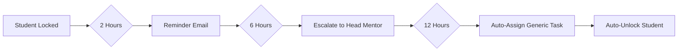

# 🚀 Alcovia Intervention Engine

A closed-loop intervention system that detects when students are falling behind and automatically triggers a mentorship workflow with real-time updates.

## 🎯 Features

### ✅ Core Requirements
- **Backend State Management**: SQL database tracking student status (active → needs_intervention → remedial)
- **Logic Gates**: Automatic intervention triggering based on performance thresholds
- **n8n Automation**: Human-in-the-loop mentor approval workflow
- **Real-time Frontend**: React app that responds to backend state changes

### ⭐ Bonus Challenges Implemented
- **🎁 Tab Switching Detection**: Focus sessions automatically fail if student switches tabs
- **🎁 Real-time WebSocket Updates**: App unlocks instantly when mentor approves (no refresh needed)

### 💎 Premium Features
- Glassmorphism dark mode UI
- Smooth animations with Framer Motion
- Fail-safe auto-escalation mechanism
- Complete audit trail in database

---

## 📁 Project Structure

```
alcovia-intervention-engine/
├── backend/                # Node.js + Express + Socket.io
│   ├── src/
│   │   ├── config/
│   │   │   └── database.js         # Supabase connection
│   │   ├── routes/
│   │   │   └── student.js          # API endpoints with logic gates
│   │   ├── middleware/
│   │   │   └── errorHandler.js
│   │   └── server.js               # Main server with WebSocket
│   ├── schema.sql                  # Database schema
│   ├── package.json
│   └── .env.example
├── frontend/               # React + Vite + Tailwind
│   ├── src/
│   │   ├── components/
│   │   │   ├── NormalState.jsx     # Focus timer + quiz
│   │   │   ├── LockedState.jsx     # Waiting for mentor
│   │   │   └── RemedialState.jsx   # Assigned task
│   │   ├── hooks/
│   │   │   └── useTabVisibility.js # Bonus: Tab detection
│   │   ├── services/
│   │   │   ├── socket.js           # Bonus: WebSocket client
│   │   │   └── api.js
│   │   ├── App.jsx
│   │   └── index.css
│   ├── package.json
│   └── .env.example
├── n8n/
│   └── workflow.json               # Import to n8n
└── README.md
```

---

## 🛠️ Setup Instructions

### 1. Database Setup (Supabase)

1. Go to [supabase.com](https://supabase.com) and create a free account
2. Create a new project
3. Go to **SQL Editor** and run the contents of `backend/schema.sql`
4. Go to **Project Settings** → **API** and copy:
   - `Project URL` (SUPABASE_URL)
   - `anon public` key (SUPABASE_KEY)

### 2. Backend Setup

```bash
cd backend

# Create .env file
cp .env.example .env

# Edit .env and add your Supabase credentials:
# SUPABASE_URL=https://your-project.supabase.co
# SUPABASE_KEY=your-anon-key
# N8N_WEBHOOK_URL=will-add-later
# PORT=3001
# FRONTEND_URL=http://localhost:5173

# Install dependencies
npm install

# Start server
npm run dev
```

Server will start at `http://localhost:3001`

### 3. Frontend Setup

```bash
cd frontend

# Create .env file
cp .env.example .env

# Edit .env:
# VITE_API_URL=http://localhost:3001
# VITE_SOCKET_URL=http://localhost:3001

# Install dependencies
npm install

# Start dev server
npm run dev
```

Frontend will open at `http://localhost:5173`

### 4. n8n Workflow Setup

#### Option A: n8n Cloud (Recommended)
1. Go to [n8n.io](https://n8n.io) and create a free account
2. Create a new workflow
3. Click **Import** and upload `n8n/workflow.json`
4. Configure the **Send Email** node with your email credentials (Gmail, SendGrid, etc.)
5. Activate the workflow
6. Copy the **Webhook URL** from the first node
7. Add it to backend `.env` as `N8N_WEBHOOK_URL`
8. Restart backend server

#### Option B: Self-hosted n8n
```bash
npx n8n
# Visit http://localhost:5678
# Import workflow.json
# Configure as above
```

---

## 🧪 Testing the Complete Flow

### Test 1: Success Case (No Intervention)
1. Open app at `http://localhost:5173`
2. Start a 30-minute focus timer
3. **Don't switch tabs!**
4. Wait for timer to finish (or click "End Early")
5. Enter quiz score: **8** (>7)
6. Submit
7. ✅ Should show "On Track" status

### Test 2: Failure Case (Intervention Triggered)
1. Start a 30-minute focus timer
2. Wait for it to finish
3. Enter quiz score: **4** (≤7)
4. Submit
5. 🔒 App should immediately lock
6. 📧 Check email (ravishrk0407@gmail.com) for intervention notification
7. Click one of the task assignment buttons in email
8. ⚡ App should unlock **instantly** (WebSocket magic!)
9. Complete the assigned task
10. ✅ Back to normal state

### Test 3: Tab Switching (Bonus Challenge #1)
1. Start a focus timer
2. **Switch to another tab or minimize browser**
3. Return to app
4. Notice session failed automatically
5. Submit with any quiz score
6. 🔒 App locks due to tab switching violation

### Test 4: Real-time Unlock (Bonus Challenge #2)
1. Trigger an intervention (submit bad scores)
2. Keep app open and visible
3. From another device/browser, click email link to assign task
4. ⚡ Watch the app unlock **without refreshing**!

---

## 🔑 API Endpoints

### `GET /api/student-status/:studentId`
Get current student status and active intervention

### `POST /api/daily-checkin`
Submit daily check-in with logic gates
```json
{
  "student_id": "uuid",
  "quiz_score": 7,
  "focus_minutes": 45,
  "tab_switched": false
}
```

**Logic Gate:**
- Success: `quiz_score > 7 AND focus_minutes > 60 AND !tab_switched`
- Failure: Creates intervention, triggers n8n webhook, emits WebSocket event

### `POST /api/assign-intervention`
Called by n8n to assign task
```json
{
  "intervention_id": "uuid",
  "assigned_task": "Read Chapter 4",
  "assigned_by": "Mentor Name"
}
```

### `POST /api/complete-intervention`
Student marks task complete
```json
{
  "student_id": "uuid",
  "intervention_id": "uuid"
}
```

---

## 🛡️ Fail-Safe Mechanism (System Design)

**Problem:** What if the mentor doesn't respond for 12+ hours? Student is locked indefinitely.

**Solution: Multi-Tier Auto-Escalation**



### Implementation Details

1. **Database Function** (already in schema.sql):
   ```sql
   -- Auto-unlocks students stuck for 12+ hours
   CREATE FUNCTION auto_unlock_stale_interventions()
   ```

2. **Cron Job** (recommended):
   - Add to Supabase: `SELECT cron.schedule('auto-unlock', '0 * * * *', 'SELECT auto_unlock_stale_interventions()')`
   - Or use external cron service to call backend endpoint

3. **Escalation Tiers**:
   - **T+2hr**: Automated reminder email
   - **T+6hr**: Escalate to senior mentor pool
   - **T+12hr**: Auto-assign: "Review previous week materials and contact your mentor"

**Benefits:**
- No student stuck indefinitely
- Maintains human oversight where possible
- Full audit trail for accountability
- Configurable thresholds via environment variables

---

## 🎨 Design Philosophy

### Premium UI Principles
- **Dark Mode First**: Modern gradient backgrounds
- **Glassmorphism**: Backdrop blur effects on cards
- **Micro-animations**: Smooth transitions and loading states
- **State-based Design**: Clear visual distinction between states
- **Real-time Feedback**: Instant WebSocket updates

### Tech Stack Reasoning

| Layer | Choice | Why |
|-------|--------|-----|
| Database | PostgreSQL (Supabase) | SQL requirement, managed hosting, real-time subscriptions |
| Backend | Node.js + Express | JavaScript consistency, Socket.io native support |
| Real-time | Socket.io | Bidirectional communication, room-based targeting |
| Frontend | React + Vite | Fast HMR, component-based, Framer Motion integration |
| Styling | Tailwind CSS | Rapid development, consistent design tokens |
| Automation | n8n | Visual workflow builder, webhook support, wait nodes |

---

## 🚀 Deployment

### Backend (Railway/Render)
```bash
# Add PostgreSQL addon
# Set environment variables
# Deploy from Git
```

### Frontend (Vercel)
```bash
vercel
# Set VITE_API_URL to production backend URL
```

### n8n
Already on cloud at n8n.io (or self-host on Railway)

---

## 📊 Database Schema

### `students`
- `id` (UUID, PK)
- `name` (VARCHAR)
- `email` (VARCHAR, UNIQUE)
- `status` (active | needs_intervention | remedial)
- `created_at` (TIMESTAMP)

### `daily_logs`
- `id` (UUID, PK)
- `student_id` (FK → students)
- `quiz_score` (INTEGER 0-10)
- `focus_minutes` (INTEGER)
- `success` (BOOLEAN)
- `tab_switched` (BOOLEAN)
- `logged_at` (TIMESTAMP)

### `interventions`
- `id` (UUID, PK)
- `student_id` (FK → students)
- `reason` (TEXT)
- `quiz_score` (INTEGER)
- `focus_minutes` (INTEGER)
- `assigned_task` (TEXT)
- `assigned_by` (VARCHAR)
- `assigned_at` (TIMESTAMP)
- `completed` (BOOLEAN)
- `completed_at` (TIMESTAMP)
- `created_at` (TIMESTAMP)

---

## 🎥 Loom Video Checklist

Record a **5-minute walkthrough** showing:

1. ✅ App in Normal State (show student name)
2. ✅ Submit bad score (quiz < 7 OR focus < 60)
3. ✅ App enters Locked State immediately
4. ✅ Show email received with student stats
5. ✅ Click task assignment button in email
6. ✅ App unlocks **instantly** (show WebSocket in action)
7. ✅ Show assigned task in Remedial State
8. ✅ Mark task complete
9. ✅ Return to Normal State
10. ✅ (Bonus) Show tab switching detection

---

## 🏆 What Makes This Special

1. **Both Bonus Challenges**: Tab detection + Real-time WebSockets
2. **Production-Ready**: Error handling, validation, logging
3. **Premium UI**: Not a basic MVP - looks professional
4. **System Design**: Documented fail-safe mechanism
5. **Complete Audit Trail**: Every action tracked in database
6. **Scalable Architecture**: Room-based Socket.io, stateless backend

---

## 🤝 Author

**Ravish Kumar**  
Email: ravishrk0407@gmail.com

Built for Alcovia Full Stack Engineering Intern Assignment

---

## 📝 License

MIT License - Built with ❤️ for Alcovia

